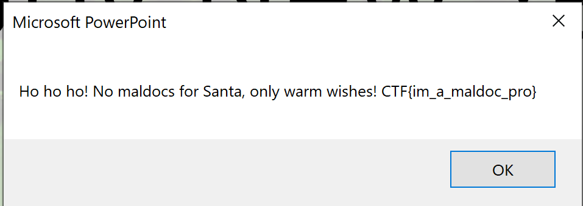

# Hacky-Holidays-2020-Writeups

[TOC]

## Happy New Maldoc

>   #### CHALLENGE INFORMATION
>
>   Santa received a document containing some wishes for him… We're not entirely sure though whether it's virus-free.
>
>   *Author information: This challenge is developed by Deloitte.*

We are provided a file named HappyNewYear.pptm. This is indicates that it is a power point presentation with macros enable (as indicated by the .pptm extension). 

After opening the file we see:


Before doing anything I like seeing what will happen so I run the presentation (macros are enabled) and I get a pop saying:

>   These wishes are not intended for you!

Dang it! One can always hope that something happens without doing anything XD. Anyway, considering that macros are enabled it would be a good idea to check out the macro scripts. You can do this by navigating to `View > Macros`. Select any of the scripts that pop up and click on `edit` and a screen with all the functions in the script will show up. You can view this here: https://gist.github.com/goelp14/01f1fad0c4abc5f57f1ed3aab5e751a8.

Immediately the functions that stand out are:

```vbscript
Private Sub CommandButton1_Click()
Function Enc(s, k)
Function Dec(s, k)
Function RunRC4(sMessage, strKey)
Function EncodeBase64(text As String) As String
Private Function DecodeBase64(ByVal strData As String) As Byte()
```

This is because they all seem to be related to what displays the flag. In particular the driving code snippet seems to be:

```vbscript
Private Sub CommandButton1_Click()
    On Error GoTo ErrorHandler
    Dim cap As String
    cap = Left(Replace(Mid(Application.Caption, 20), vbCrLf, ""), 30)
    Dim sHN As String
    sHN = Environ$(Dec("I0oc7Ct1kjUHseAQ", cap))
    If sHN = Dec("E2Q/yB8spwQ=", cap) Then
        MsgBox Dec("4VfbF+mqMo99Lf4tBDxDMlHxexR8X22edPWRhv7i/os9370BLJVJ7KnAxCAxI5q23fFa0TL8PB1TsI3VzPMzkbBc0Fy+dg==", cap & sHN)
    Else
        MsgBox Dec("FE0U7zshgC4auOgGQblTudKFKmeR1eBLERzfvNOpnhKT38UbEfU=", cap)
    End If
    Exit Sub
    
ErrorHandler:
    MsgBox ("No wishes for you...")
 
End Sub
```

`MsgBox` means that a pop up will display some text. This is the only code snippet that has the popup so most likely the flag is one of these popups. Unfortunately it looks like it is hidden behind some kind of encryption (based on the existence of `Dec()`). Now, I _could_ try and break the encryption, but eh that seems like a lot of effort (or simply _some_ effort for that matter). The quickest thing to notice is there is an if statement:

```vbscript
If sHN = Dec("E2Q/yB8spwQ=", cap)
```

Typically the flag is either going to display when the if statement evaluates to true so I am going to proceed with that assumption. Now the question is "how do make the if statement evaluate to true?".  It is dependent on the variable sHN which is earlier set with:

```vbscript
sHN = Environ$(Dec("I0oc7Ct1kjUHseAQ", cap))
```

Ok so how in the world do I make this work? Well you first have to notice that the flag exists in this challenge **locally**. This means that if you modify the code it is possible to obtain the flag. This led me to simply modify

```vbscript
sHN = Environ$(Dec("I0oc7Ct1kjUHseAQ", cap))
```

to

```vbscript
sHN = Dec("E2Q/yB8spwQ=", cap)
```

Since that's what the if statement is looking for. After saving this updated macro to a new duplicate of the power point I simply of to run the presentation again. Now I get the following popup:



*Flag is: CTF{im_a_maldoc_pro}*