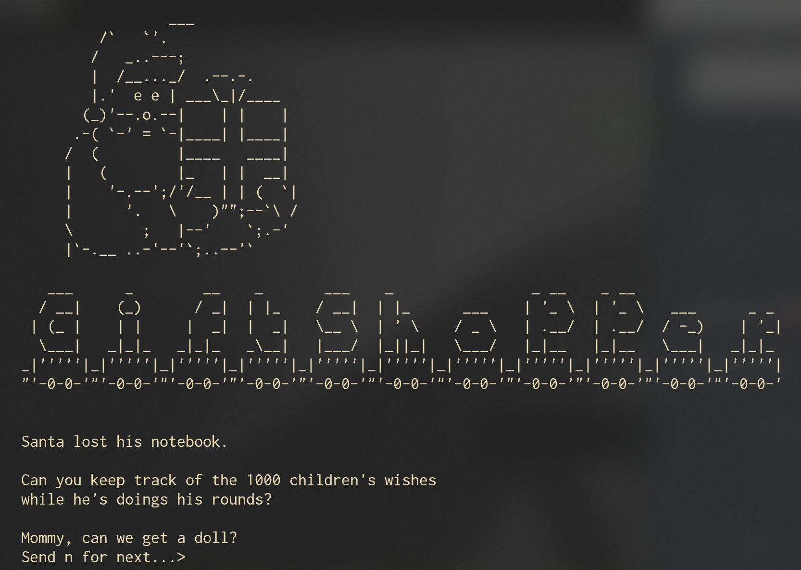
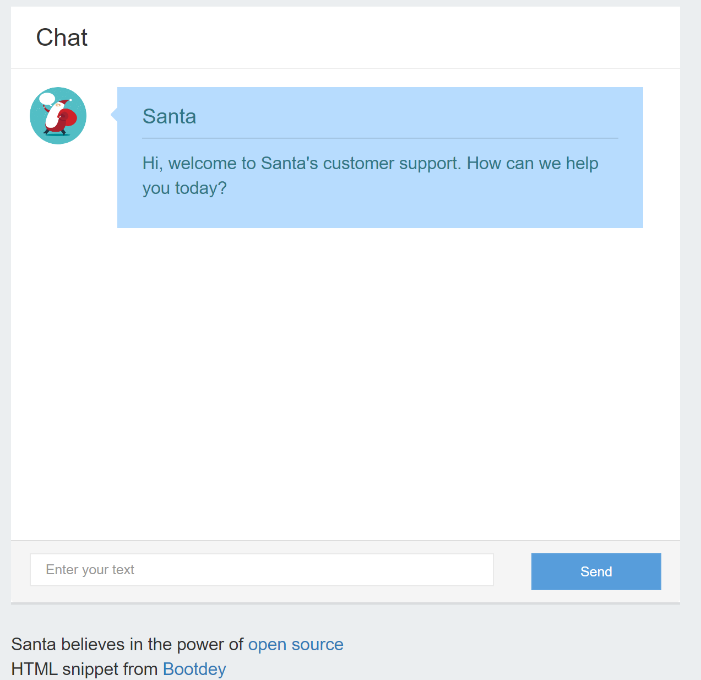
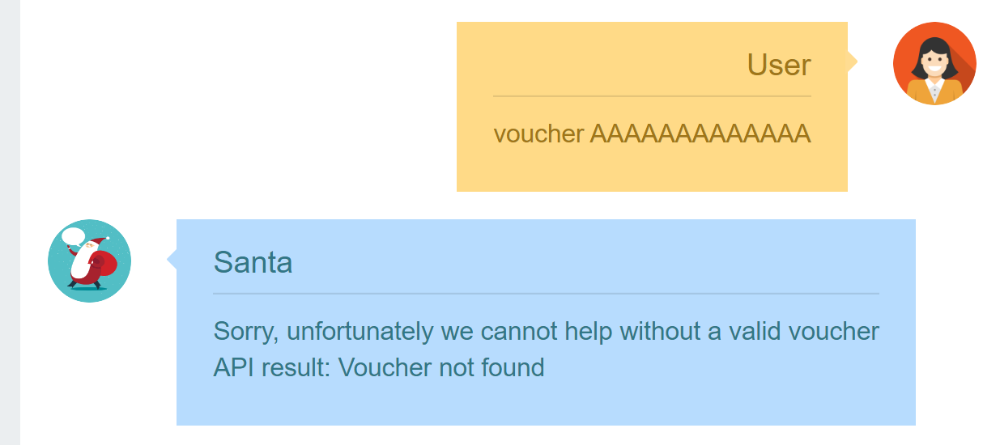
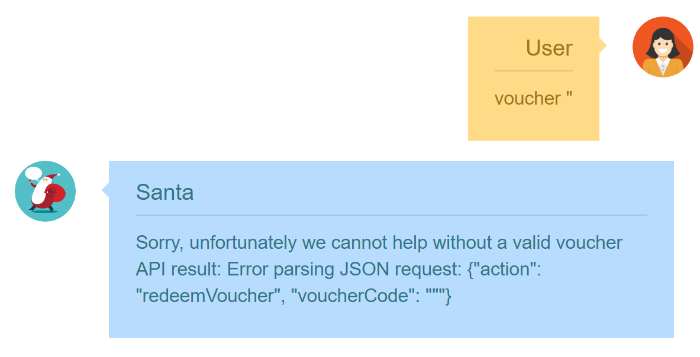
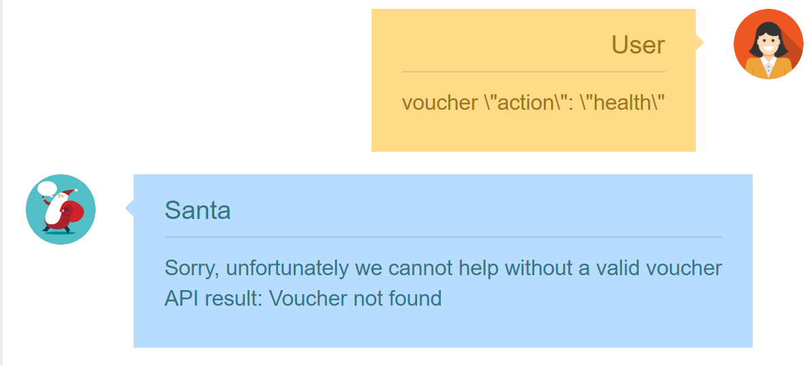

# Hacky-Holidays-2020-Writeups

TOC:

| Name                                              | Category    | Points |
| ------------------------------------------------- | ----------- | ------ |
| [Happy New Maldoc](#happy-new-maldoc)             | `reversing` | 125    |
| [Santa's Giftshopper](#santas-giftshopper)        | `ppc`       | 100    |
| [Santa Customer Support](#santa-customer-support) | `web`       | 100    |

Note that I am only providing writeups of challenges I completely solved. A lot of them contained multiple parts that were not solved all the way through.

## Happy New Maldoc

### WISHES

>   #### CHALLENGE INFORMATION
>
>   Santa received a document containing some wishes for him… We're not entirely sure though whether it's virus-free.
>
>   *Author information: This challenge is developed by Deloitte.*

We are provided a file named HappyNewYear.pptm. This is indicates that it is a power point presentation with macros enable (as indicated by the .pptm extension). 

After opening the file we see:


Before doing anything I like seeing what will happen so I run the presentation (macros are enabled) and I get a pop saying:

>   These wishes are not intended for you!

Dang it! One can always hope that something happens without doing anything XD. Anyway, considering that macros are enabled it would be a good idea to check out the macro scripts. You can do this by navigating to `View > Macros`. Select any of the scripts that pop up and click on `edit` and a screen with all the functions in the script will show up. You can view this here: https://gist.github.com/goelp14/01f1fad0c4abc5f57f1ed3aab5e751a8.

Immediately the functions that stand out are:

```vbscript
Private Sub CommandButton1_Click()
Function Enc(s, k)
Function Dec(s, k)
Function RunRC4(sMessage, strKey)
Function EncodeBase64(text As String) As String
Private Function DecodeBase64(ByVal strData As String) As Byte()
```

This is because they all seem to be related to what displays the flag. In particular the driving code snippet seems to be:

```vbscript
Private Sub CommandButton1_Click()
    On Error GoTo ErrorHandler
    Dim cap As String
    cap = Left(Replace(Mid(Application.Caption, 20), vbCrLf, ""), 30)
    Dim sHN As String
    sHN = Environ$(Dec("I0oc7Ct1kjUHseAQ", cap))
    If sHN = Dec("E2Q/yB8spwQ=", cap) Then
        MsgBox Dec("4VfbF+mqMo99Lf4tBDxDMlHxexR8X22edPWRhv7i/os9370BLJVJ7KnAxCAxI5q23fFa0TL8PB1TsI3VzPMzkbBc0Fy+dg==", cap & sHN)
    Else
        MsgBox Dec("FE0U7zshgC4auOgGQblTudKFKmeR1eBLERzfvNOpnhKT38UbEfU=", cap)
    End If
    Exit Sub
    
ErrorHandler:
    MsgBox ("No wishes for you...")
 
End Sub
```

Note that `MsgBox` means that a pop up will display some text and that you can think of `Sub` as a function.  This is the only code snippet that has the popup so most likely the flag is one of these popups. Unfortunately it looks like it is hidden behind some kind of encryption (based on the existence of `Dec()`). Now, I _could_ try and break the encryption, but eh that seems like a lot of effort (or simply _some_ effort for that matter). The quickest thing to notice is there is an if statement:

```vbscript
If sHN = Dec("E2Q/yB8spwQ=", cap)
```

Typically the flag is either going to display when the if statement evaluates to true so I am going to proceed with that assumption. Now the question is "how do make the if statement evaluate to true?".  It is dependent on the variable sHN which is earlier set with:

```vbscript
sHN = Environ$(Dec("I0oc7Ct1kjUHseAQ", cap))
```

Ok so how in the world do I make this work? Well you first have to notice that the flag exists in this challenge **locally**. This means that if you modify the code it is possible to obtain the flag. This led me to simply modify

```vbscript
sHN = Environ$(Dec("I0oc7Ct1kjUHseAQ", cap))
```

to

```vbscript
sHN = Dec("E2Q/yB8spwQ=", cap)
```

Since that's what the if statement is looking for. After saving this updated macro to a new duplicate of the power point I simply of to run the presentation again. Now I get the following popup:


*Flag is: CTF{im_a_maldoc_pro}*

It seems like the idea of the challenge was to introduce the ideas that macros can be harmful to your computer since they can just execute locally. I'm not sure if the authors were intending that it is solved via encryption but I am always a fan of the solution that requires less effort.

## Santa's Giftshopper

### NOTEKEEPER

>   #### CHALLENGE INFORMATION
>
>   Santa lost his notebook, can you keep notes for him while shopping for Christmas presents?

We are given a URL to some tcp connection. You can access the service by using netcat as follows: ` nc <service-url> <port>`. Make sure you do NOT include the `tcp://`. You should be greeted with the following in your console:



If you type `n` and press enter it prints out another line with the same message. It looks like this will happen 1000 times since it asks "Can you keep track of the 1000 children's wishes". I really do not want to manually go through this so let's try automating it! I like using a python package called `pwntools` to interact as if its netcat but I believe there are several other packages that would also work. In this case I first want to keep going through each 1000 child's wish and save that somehow to look through. This is so that I can get an idea of whats happening with each wish and all the items that are being wished for. The code I used for that can be found here: https://gist.github.com/goelp14/9c5810894045813b22ede6a2eca4e23d.

After going through the output file I found that there were 10 gifts that the children wished for. They were

-   racecar
-   mouse
-   book
-   kitten
-   binoculars
-   crayons
-   console
-   doll
-   guitar
-   puzzle

Now before we do anything else, its a good idea to see what we get after going through all 1000 wishes. As a result added extra lines:

```python
r.send(b'n\n')
print(r.recvuntil(b'\n\n'))
print(r.recvuntil(b' > '))
```

This is because I needed to send an n to get the next bit of text and it was a pretty good bet that I will get text until two back to back newlines or a `>` (since it indicates to input something). I did both in case one would be incorrect. I got lucky and they both worked:

>   I think we've got them all for this year!
>
>   Have you remembered all the presents we should buy?
>
>   
>
>   How many binoculars should we get? > 

This makes it pretty clear that I need to be counting all the items and then entering in the correct number of wishes based on the item prompted. I could have used the `output.txt` generated but I felt like that would actually be too much effort. I figured that I could keep track as it goes through each wish. I decided a really easy way to do this is using a dictionary since I can just check if the key value is used in the sentence and update the corresponding count as it goes.

I did this with the following code snippet (look at comments):

```python
from pwn import *

saveNotebook = []
r = remote('<TCP-URL-HERE-NO-TCP://-INCLUDED>', <PORT>)
r.recvuntil('rounds?\n\n')
f = open("output.txt", "w+")
output = r.recvuntil('..> ')
items = {'racecar': 0, 'mouse': 0, 'book': 0, 'kitten': 0, 'binoculars': 0, 'crayons': 0, 'console': 0, 'doll': 0, 'guitar': 0, 'puzzle': 0} # initialize dictionary with each gift set to 0
f.write(output.decode('utf-8'))
s = output.split(b'\nSend') # The relevant info is before \nSend so the split is used to isolate that string
s = s[0].decode("utf-8") # convert to string for easier use
s = s.strip('\n') # get rid of any \n in case I want to print for debugging
# Iterate through each key in the dictionary and check if it is in the wish
# If it is, then update that key value by adding 1 to the count
for item in items.keys():
        if item in s:
            items[item] += 1
```

Now, after going through all 1000 wishes I should have the number of times each item was wished for. I now just have to answer each question on how many of each item to get which can be done with a similar method as in the previous code snippet.

```python
q = r.recvuntil(b' > ') # get the question
print(q) # print for reference
keyword = q.split(b' ')[2].decode("utf-8") # make into an array of words and take the third word since it follows the format 'How many <keyword> should we get?'
print("Keyword is %s\n" % keyword) # print for reference
print('Number of times Asked: %s' % items[keyword]) # print for reference
print(str(items[keyword]).encode('ascii')) # print for reference
r.send(str(items[keyword]).encode('ascii')) # send the resulting count of the item encoded since it only takes byte string
r.send(b'\n') # submit answer
```

After reading the next line with another `q = r.recvuntil(b' > ')`, it becomes clear that the format of the questions are most likely going to be the same.  Since there are 10 items I probably will have to do this 10 times for each item. So now all I have to do is throw the above code into a for loop and boom done. I ran this code but, no flag? I then realize that I never actually received what comes after so the flag would not be printed. Since the format of the flag is `CTF{}`, I figured I could just take everything up until `}` and the flag should be in the printout.

You can see my full code here: https://gist.github.com/goelp14/1fe50273b86ca305c7b4a51f0b39beba

The resulting printout at the end is:

>   Awesome! Thanks to you everyone will get their desired gift!
>
>   Here's a flag to thank you! CTF{S4nt4-H4s-4-B4d-M3m0ry}

Flag: CTF{S4nt4-H4s-4-B4d-M3m0ry}

## Santa Customer Support

### RECOVER YOUR LOST GIFT

>   #### CHALLENGE INFORMATION
>
>   Did you lose any gifts and need to find it again? We offer customer support!

We are given a URL that shows:



Looks like it is a customer support chat! Thankfully it looks like Santa decided to make the his code open source so after clicking on it we get:

```python
import sys, os
from flask import Flask, render_template, request, jsonify
import random
import backend_api

app = Flask(__name__)
flag = os.environ['FLAG']

@app.route("/")
def index():
    return render_template("chat.html")

keywords = {
        ('gift', 'present'): 'If you are contacting us regarding a lost or misplaced gift.\nPlease make sure you present your unique gift voucher code by entering voucher <voucher-code>',
        ('sing', 'song', 'jingle bells'): "It's Christmas\nJingle bells, jingle bells\nJingle all the way\nOh, what fun it is to ride\nIn a one horse open sleigh",
        ('help', ): 'You can ask me about your presents or ask me to sing a song',
        ('hi', 'hello'): 'Nice to meet you! My name is Santa!'
}
rnd = [
        'Hohoho merry x-mas',
        'You can make inquiries here about any lost of misplaced gifts',
]

@app.route("/message", methods = ["POST"])
def msg():
    msg = request.form.get('message', '')
    if msg.lower().startswith('voucher '):
        voucher = msg.split(' ',1)[1]
        return jsonify(process(voucher))
    for k,v in keywords.items():
        for w in k:
            if w in msg.lower():
                return jsonify(v)
    return jsonify(random.choice(rnd))

@app.route("/source")
def source():
    return os.popen("source-highlight -i /app/main.py -o STDOUT").read()

@app.route("/health")
def health():
    res = backend_api.post(data="{\"action\": \"health\"}")
    if res.status_code == backend_api.STATUS_OK:
        return jsonify(santa_status='UP', voucher_backend='UP')
    return jsonify(santa_status='UP', voucher_backend='DOWN')

# Santa is a micro-services kind of guy so the voucher
# validation is running as a seperate service that we interact with
# via POST requests
def process(voucher):
    res = backend_api.post(data="{\"action\": \"redeemVoucher\", \"voucherCode\": \"" + voucher + "\"}")
    if res.status_code == backend_api.STATUS_OK:
        return f"Good news, we found your lost present\n🎄📦🎁 {flag} 🎄📦🎁"
    return f"Sorry, unfortunately we cannot help without a valid voucher\nAPI result: {res.data}"
```

Sweet!

First we notice this is a flask app and the flag is saved in the backend environment. Flask utilizes an idea called `route` where if you hit the route via URL or a specific GET/POST request it will execute corresponding code. Let's examine the first route:

```python
@app.route("/")
def index():
    return render_template("chat.html")

keywords = {
        ('gift', 'present'): 'If you are contacting us regarding a lost or misplaced gift.\nPlease make sure you present your unique gift voucher code by entering voucher <voucher-code>',
        ('sing', 'song', 'jingle bells'): "It's Christmas\nJingle bells, jingle bells\nJingle all the way\nOh, what fun it is to ride\nIn a one horse open sleigh",
        ('help', ): 'You can ask me about your presents or ask me to sing a song',
        ('hi', 'hello'): 'Nice to meet you! My name is Santa!'
}
rnd = [
        'Hohoho merry x-mas',
        'You can make inquiries here about any lost of misplaced gifts',
]
```

Very simply this is indicating that at the base URL of the website the chat HTML template will be rendered and the values for `keywords`and `rnd` are stored. Not much to look into here. Let's look at the next route:

```python
@app.route("/message", methods = ["POST"])
def msg():
    msg = request.form.get('message', '')
    if msg.lower().startswith('voucher '):
        voucher = msg.split(' ',1)[1]
        return jsonify(process(voucher))
    for k,v in keywords.items():
        for w in k:
            if w in msg.lower():
                return jsonify(v)
    return jsonify(random.choice(rnd))
```

Now this is more interesting. There is an argument called `methods` indicating that this is a POST request. What this means is that I can **send** data to the route in order for something to happen. This particular code looks like it stores the data sent into a variable called `msg`. The if statement indicates that if this message starts with `voucher` then it will take the next word as the input to a different function. This "word" can be anything (numbers, letters, etc.). Otherwise it will simply choose a response based on a keyword or something random (refer to variables `keywords` and `rnd`). Ok so lets check out that `procces()` function since that looks suspicious.

```python
# Santa is a micro-services kind of guy so the voucher
# validation is running as a seperate service that we interact with
# via POST requests
def process(voucher):
    res = backend_api.post(data="{\"action\": \"redeemVoucher\", \"voucherCode\": \"" + voucher + "\"}")
    if res.status_code == backend_api.STATUS_OK:
        return f"Good news, we found your lost present\n🎄📦🎁 {flag} 🎄📦🎁"
    return f"Sorry, unfortunately we cannot help without a valid voucher\nAPI result: {res.data}"
```

It looks like this code makes another post request to some backend api. It then checks if this post request is valid. If it is it returns our flag! Awesome! At this point I tried typing in `voucher AAAAAAAAAAAAA` into the chat to see what happens.



Sadly it does not return the flag, but we clearly have found the way to access `process()`!

Before I continue lets look at the other routes.

```python
@app.route("/source")
def source():
    return os.popen("source-highlight -i /app/main.py -o STDOUT").read()
```

This is what shows the backend code we are looking at. Note that this happens by adding `/source` to the URL.

```python
@app.route("/health")
def health():
    res = backend_api.post(data="{\"action\": \"health\"}")
    if res.status_code == backend_api.STATUS_OK:
        return jsonify(santa_status='UP', voucher_backend='UP')
    return jsonify(santa_status='UP', voucher_backend='DOWN')
```

This lets us know if the backend is healthy (is it up?). If you go to https://santacustomersupport.challenge.hackazon.org/health the resulting page says: `{"santa_status":"UP","voucher_backend":"UP"}`. Cool!

Now lets go back to figuring out how to get the flag. Since the wrong voucher still prints out the response data we can probably see if any error messages occur. Since the format of the post request data is `"{\"action\": \"redeemVoucher\", \"voucherCode\": \"" + voucher + "\"}"`, there is a good chance that sending `"`will cause an error. This is because it is not sanitized and what you type is injected directly into a POST request.



I got an error! This indicates that injecting something in is possible. But how do I know what to send? Well first look at how the flag is decided. It isn't from a specific voucher code, but simply if the response of the post request is valid. We also know that `/health` seems to always return that the post request is OK. This lead to the idea that maybe I could somehow have it check for `/health` instead. It looks like health is checked when a POST request is made with the data as a JSON `\"action\": \"health\"`. So I then tried doing that with voucher.



No error and no flag :(. I know that `"` should cause an error so maybe the `\` is escaping it so that nothing happens.


Waiiiiiiiiit a moment. This looks really close to some valid JSON. Maybe I can pass in junk as voucher code and simply use the health action to make a valid POST request with a OK response. Each command is separated by a comma so I tried `garbagenobodycaresabout", "action": "health`. I don't include the quotes at the start and end since the variable is already surrounded by quotes.


Yay! We got the flag!

Flag: CTF{766e0ca1}